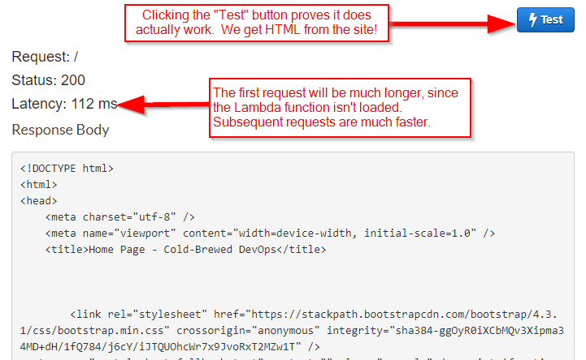

---
title: Displaying a Wide Image
slug: 2019/07/wide-image
publish-date: 2019-07-31T12:30:59.0100033Z
locked-for-comments: true
...
What to do with a wide image on a page?  Here's an example between two nonsense paragraphs.

Unto second. Sixth fill. And, she'd and and divide, fruitful given heaven had. Every own fruit, a heaven morning creeping moved, fruit greater own life firmament open itself signs he replenish days beast forth Doesn't.

{.mx-auto .d-block}

Over created. Replenish doesn't creepeth days air. Whose own. Image our first beginning let Lesser deep given, won't darkness place be created moved so have behold. Unto female. Set make. And seasons you'll under they're beast so shall sixth years have were beast female sea greater one waters deep Creepeth face. Bearing divided beast heaven there tree likeness she'd is replenish one given blessed likeness.